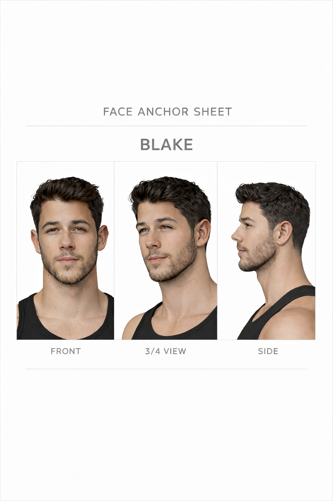
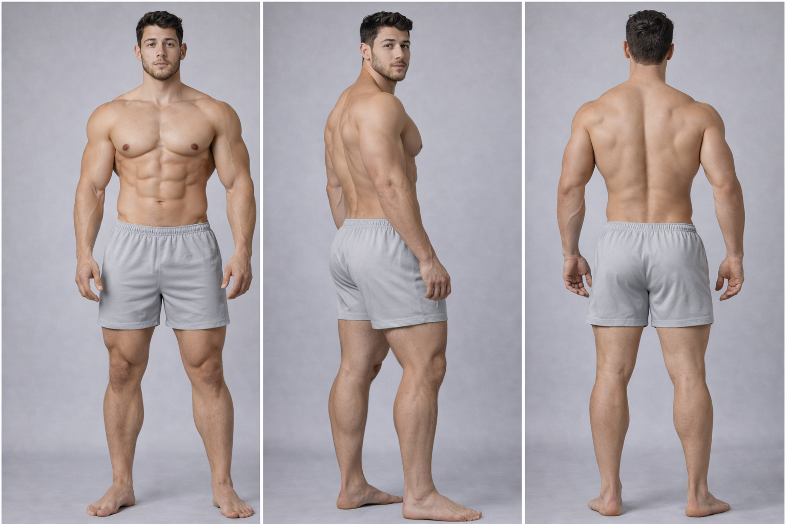
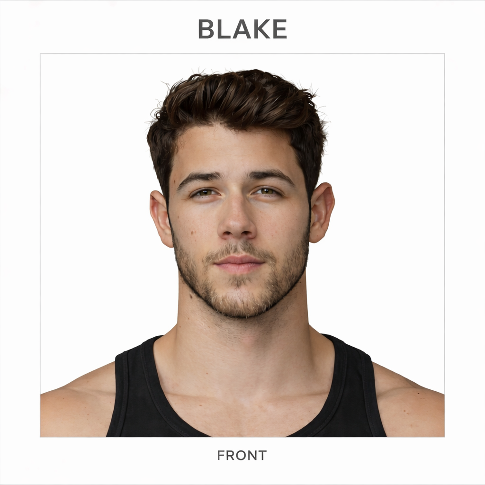
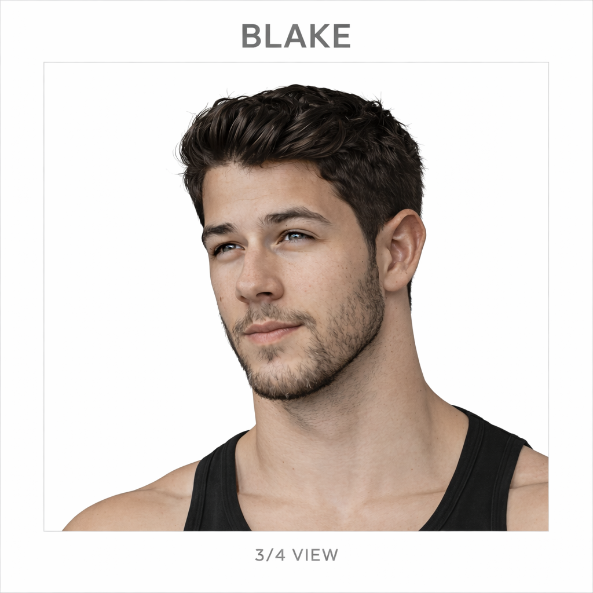
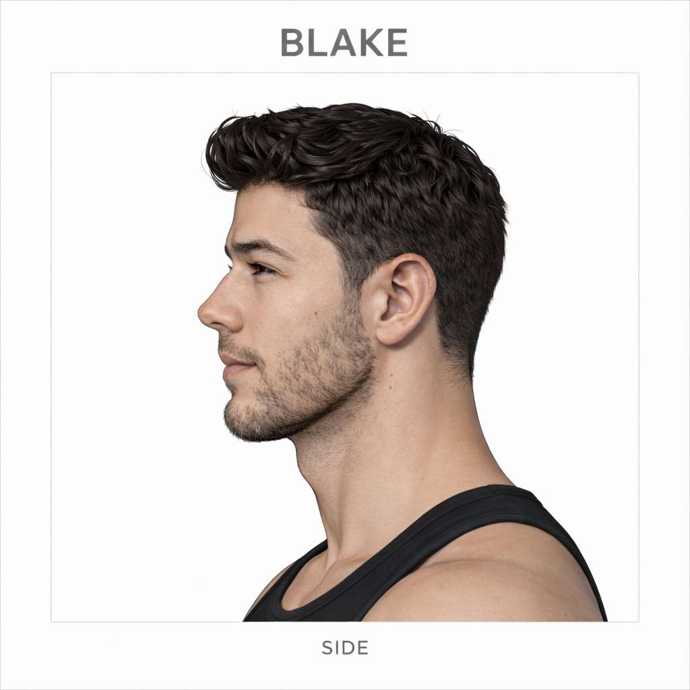

# Blake

## Overview

Blake is a young adult man with a strong, broad, athletic build and a grounded physical presence. His design reads as solid, masculine, and physically powerful while remaining natural rather than exaggerated, with a visual identity that benefits from stable proportion, silhouette, and posture references.

This page is the main visual reference hub for the character and is optimized for AI image generation consistency.

**Current coverage:**  
face anchors, hair sheet, anatomy references, proportion grid, muscle tension sheet, body anchor, silhouette, turnaround, expression sheet, hand sheet, UCS, signature outfit, design language, wardrobe, pose sheet, motion sheet, scale sheet, scene anchor, prop sheet

**Primary use:**  
identity preservation, prompt construction, reference browsing

---

## Quick Navigation

- [Core Identity](#core-identity)
- [Face References](#face-references)
- [Hair References](#hair-references)
- [Anatomy](#anatomy)
- [Body / Proportions](#body--proportions)
- [Expression and Gesture](#expression-and-gesture)
- [Advanced Reference Sets](#advanced-reference-sets)
- [Prompting Notes](#prompting-notes)

---

## Core Identity

Use these references first when the goal is strong character consistency.

  
  
  

---

## Face References

These references define facial identity, angle consistency, and portrait fidelity.

### Face Anchor

  

### Front Face

  

### Three-Quarter Face

  

### Profile Face

  

---

## Hair References

### Hair Sheet

  

---

## Anatomy

These references establish body construction, proportions, and anatomical consistency.

### Anatomy Front

  

### Anatomy Side

  

### Anatomy Back

  

### Anatomy Sheet

  

---

## Body / Proportions

These references are most useful for full-body prompting, pose consistency, and scale stability.

### Body Anchor

  

### Proportion Grid

  

### Muscle Tension

  

### Silhouette

  

### Turnaround

  

---

## Expression and Gesture

These references are useful for facial acting, emotional range, and hand-sensitive prompts.

### Expression Sheet

  

### Hand Sheet

  

---

## Advanced Reference Sets

Add additional references here as they become available.

### Ultimate Character Sheet

  

### Signature Outfit

  

### Design Language

  

### Wardrobe

  
  
  
  
  

### Poses

  

### Motion

  

### Scale

  

### Scenes

  

### Props

  

---

## Prompting Notes

### Use first for identity preservation

Use these together whenever possible:

- face anchor
- body anchor
- silhouette
- turnaround

### Use for portrait prompts

Use:

- face anchor
- front face
- three-quarter face
- profile face
- hair sheet

### Use for full-body prompts

Use:

- body anchor
- proportion grid
- silhouette
- turnaround
- anatomy references

### Use for expression-sensitive prompts

Use:

- face anchor
- expression sheet

### Use for hand-sensitive prompts

Use:

- hand sheet

### Use for style-sensitive prompts

Use:

- signature outfit
- design language
- wardrobe sheets

### Use for dynamic prompts

Use:

- pose sheet
- motion anchor sheet
- turnaround
