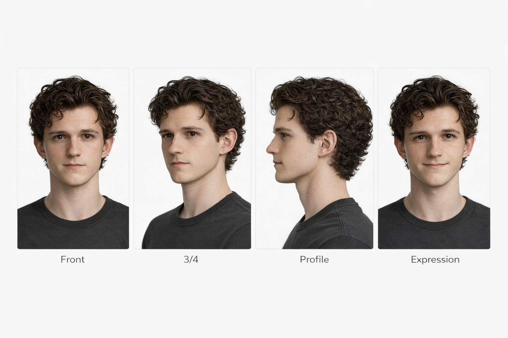

# Character Gallery

Use the character pages for detailed prompt workflows, reference priorities, and direct access to each character’s core identity pack.

  

    
    

      <h2 style="margin-top:0;">Lucien</h2>
      
<strong>170 cm (5'7")</strong> · soft-slender · occult, gothic, scholarly

      
Refined, slender, and quietly mysterious, with an occult and scholarly visual identity.

      
<a href="lucien">Open character page</a>

    

  

  

    
    

      <h2 style="margin-top:0;">Jonah</h2>
      
<strong>178 cm (5'10")</strong> · lean, elegant · refined, composed

      
Tall and long-proportioned, with a graceful silhouette and calm, controlled presence.

      
<a href="jonah">Open character page</a>

    

  

