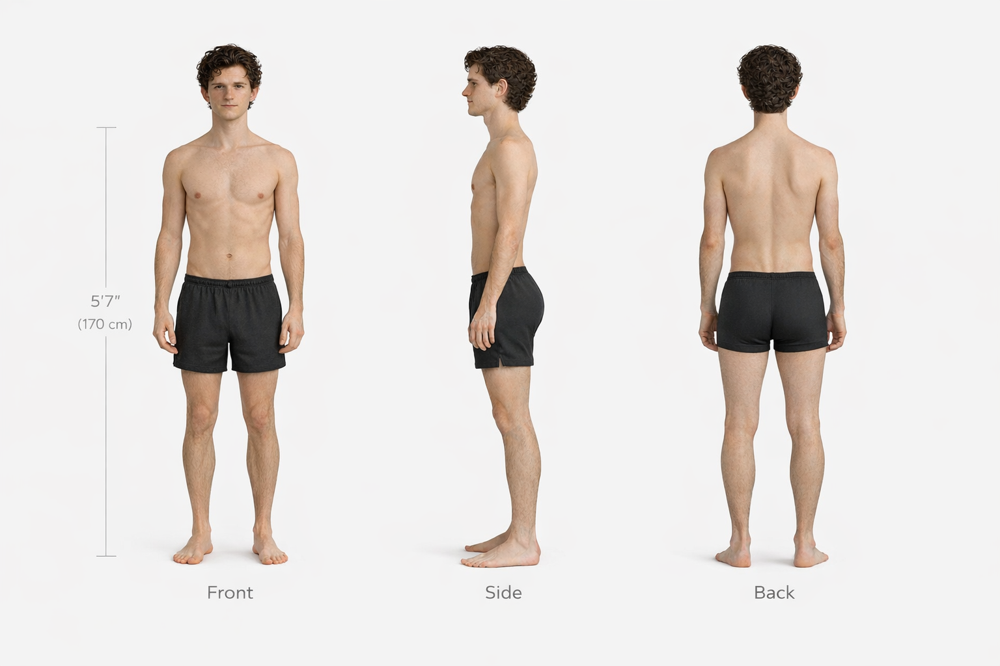

# Lucien

  

    
  

  

## Quick Identity Summary

Lucien is a slender man of average height with refined facial features, an elegant build, and a calm, slightly mysterious presence. His aesthetic is occult, scholarly, and subtly gothic, expressed through dark layered clothing, antique jewelry, and ritual-inspired accessories.

## Prompt Priority Fields

**Height:** 170 cm (5'7")  
 **Build:** lean, elegant  
 **Aesthetic:** occult, gothic, scholarly

These are the three most important traits to preserve in prompts.

## Best Starting References

1. Face Anchor Sheet
2. Anatomy Sheet
3. Ultimate Character Sheet
4. Signature Outfit Sheet
5. task-specific sheet

  

---

## Prompt Workflows

  

    <h3 style="margin-top:0;">Portrait / Face Prompts</h3>
    
<strong>Attach:</strong>

    <ul>
      <li>Face Anchor Sheet</li>
      <li>3/4 Face Reference</li>
      <li>Front Face Reference</li>
    </ul>
    
<strong>Optional:</strong>

    <ul>
      <li>Expression Sheet</li>
    </ul>
    
<strong>Prompt blocks:</strong>

    <ul>
      <li>Identity Block (Short)</li>
      <li>Face Block</li>
      <li>Expression Block</li>
    </ul>
  

  

    <h3 style="margin-top:0;">Anatomy / Physique Prompts</h3>
    
<strong>Attach:</strong>

    <ul>
      <li>Anatomy Sheet</li>
      <li>Body Proportion Grid</li>
      <li>Face Anchor Sheet</li>
    </ul>
    
<strong>Optional:</strong>

    <ul>
      <li>Muscle Tension Sheet</li>
    </ul>
    
<strong>Prompt blocks:</strong>

    <ul>
      <li>Identity Block (Extended)</li>
      <li>Body Block</li>
      <li>Movement Block</li>
    </ul>
  

  

    <h3 style="margin-top:0;">Outfit / Style Prompts</h3>
    
<strong>Attach:</strong>

    <ul>
      <li>Ultimate Character Sheet</li>
      <li>Signature Outfit Sheet</li>
      <li>Body Anchor Sheet</li>
    </ul>
    
<strong>Optional:</strong>

    <ul>
      <li>Design Language Sheet</li>
    </ul>
    
<strong>Prompt blocks:</strong>

    <ul>
      <li>Identity Block (Extended)</li>
      <li>Style Block</li>
      <li>Wardrobe Block</li>
    </ul>
  

  

    <h3 style="margin-top:0;">Pose / Motion Prompts</h3>
    
<strong>Attach:</strong>

    <ul>
      <li>Ultimate Character Sheet</li>
      <li>Signature Outfit Sheet</li>
      <li>Pose Sheet</li>
    </ul>
    
<strong>Optional:</strong>

    <ul>
      <li>Motion Sheet</li>
    </ul>
    
<strong>Prompt blocks:</strong>

    <ul>
      <li>Body Block</li>
      <li>Movement Block</li>
    </ul>
  

  

    <h3 style="margin-top:0;">Scene Prompts</h3>
    
<strong>Attach:</strong>

    <ul>
      <li>Ultimate Character Sheet</li>
      <li>Signature Outfit Sheet</li>
      <li>scene-specific references</li>
    </ul>
    
<strong>Optional:</strong>

    <ul>
      <li>Expression Sheet</li>
    </ul>
    
<strong>Prompt blocks:</strong>

    <ul>
      <li>Identity Block (Short)</li>
      <li>Style Block</li>
      <li>Expression Block</li>
    </ul>
  

---

## Identity Pack

These are Lucien’s most important reference sheets and should be attached whenever possible.

  

    
    <strong>Face Anchor Sheet</strong>
  

  

    
    <strong>Anatomy Sheet</strong>
  

  

    
    <strong>Ultimate Character Sheet</strong>
  

  

    
    <strong>Signature Outfit Sheet</strong>
  

---

## Core Profile Files

These files define Lucien conceptually.

- `docs/assets/library/10_CHARACTERS/LUCIEN/00_PROFILE/metadata.yaml`
- `docs/assets/library/10_CHARACTERS/LUCIEN/00_PROFILE/character_summary.md`
- `docs/assets/library/10_CHARACTERS/LUCIEN/00_PROFILE/prompt_blocks.md`

Recommended use:

- `metadata.yaml` → structured reference data
- `character_summary.md` → quick identity overview
- `prompt_blocks.md` → reusable character-specific prompt text

---

## Style Summary

Lucien’s style should read as:

- occult
- scholarly
- subtly gothic
- refined rather than theatrical
- ritual-aware rather than costume-like

Typical style elements:

- dark layered fabrics
- antique silver jewelry
- rings
- talismans
- soft textured materials
- muted dark palette

Avoid:

- generic sporty styling
- bright casual fashion
- bulky silhouettes
- exaggerated costume treatment

---

## Reference Sheet Categories

### Core identity

- `01_FACE/`
- `02_HAIR/`
- `03_ANATOMY/`
- `06_BODY/`
- `07_SILHOUETTE/`
- `08_TURNAROUND/`
- `11_UCS/`

### Style

- `12_SIGNATURE_OUTFIT/`
- `13_DESIGN_LANGUAGE/`
- `14_WARDROBE/`

### Motion and scenes

- `15_POSES/`
- `16_MOTION/`
- `17_SCALE/`
- `18_SCENES/`
- `19_PROPS/`

---

## Library Paths

**Main folder:**  
`docs/assets/library/10_CHARACTERS/LUCIEN/`

**Profile folder:**  
`docs/assets/library/10_CHARACTERS/LUCIEN/00_PROFILE/`

**Identity pack folder:**  
`docs/assets/library/10_CHARACTERS/LUCIEN/IDENTITY_PACK/`
