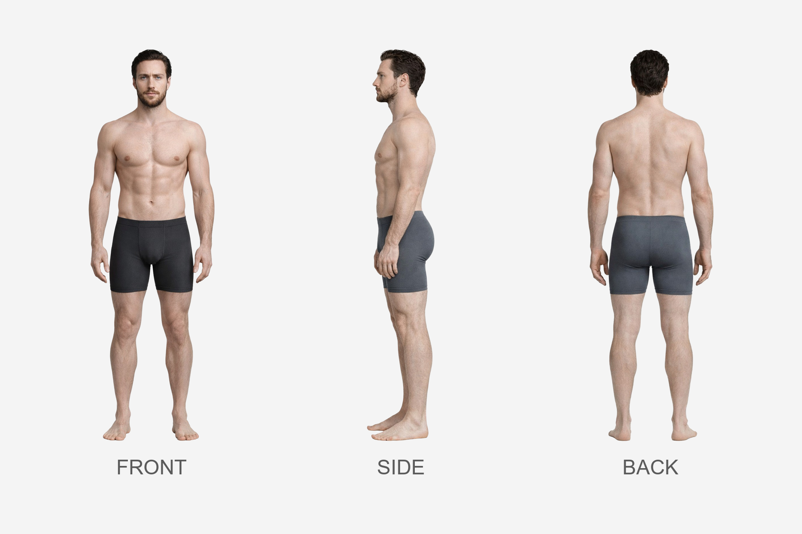
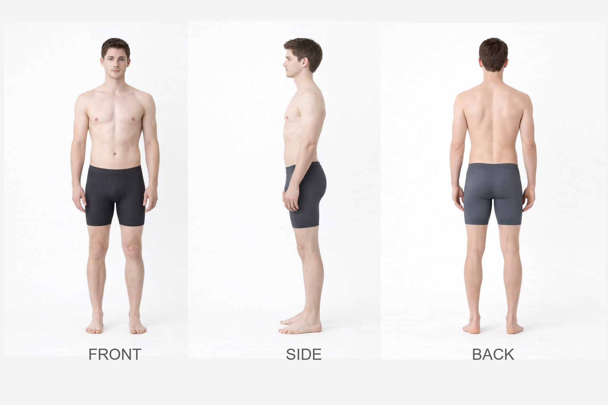

---
hide:
  - toc
---

# Alexander vs Connor

## Height Comparison

- **Alexander:** 185 cm / 6'1"
- **Connor:** 175 cm / 5'9"
- **Difference:** 10 cm / 0'4"
- **Category:** noticeable
- **Relative scale:** Alexander is approximately 5.7% taller than Connor

  

    
Height Contrast

    
Noticeable

  

  

    
Build Contrast

    
Athletic Muscular vs Runner Build

  

  

    
Silhouette Contrast

    
Power Athlete vs Runner Silhouette

  

## Visual Height Chart

  

    
180 cm

    
170 cm

    
160 cm

    
150 cm

    
140 cm

    
130 cm

    
120 cm

    
110 cm

    
100 cm

    
90 cm

    
80 cm

    
70 cm

    
60 cm

    
50 cm

    
40 cm

    
30 cm

    
20 cm

    
10 cm

  

  

  

    

      

    

    
Reference

    
180 cm / 5'11"

  

  

    

      

    

    
Alexander

    
185 cm / 6'1"

  

  

    

      

    

    
Connor

    
175 cm / 5'9"

  

## Comparison Summary

**Alexander** and **Connor** show a **Noticeable height contrast**, with **Alexander** standing **10 cm** taller than **Connor**.

In terms of build, **Alexander** reads as **Athletic Muscular**, while **Connor** reads as **Runner Build**.

Their design language also differs strongly: **Alexander** is rooted in a **Athletic Luxury** aesthetic, while **Connor** is defined more by **['Domestic Soft']** styling.

In motion, **Alexander** reads as **Deliberate Precise**, whereas **Connor** feels more **Relaxed Natural**.

Their body language pushes this contrast further: **Alexander** appears **Calm Composed**, while **Connor** appears **Soft Withdrawn**.

Facially, **Alexander** tends toward a **Calm Reserved** expression, while **Connor** reads as more **Soft Neutral**.

Their emotional presentation also differs: **Alexander** feels **Controlled**, while **Connor** feels **Gentle**.

## Anatomy Sheet Comparison

  

    
Alexander

    
  

  

    
Connor

    
  

