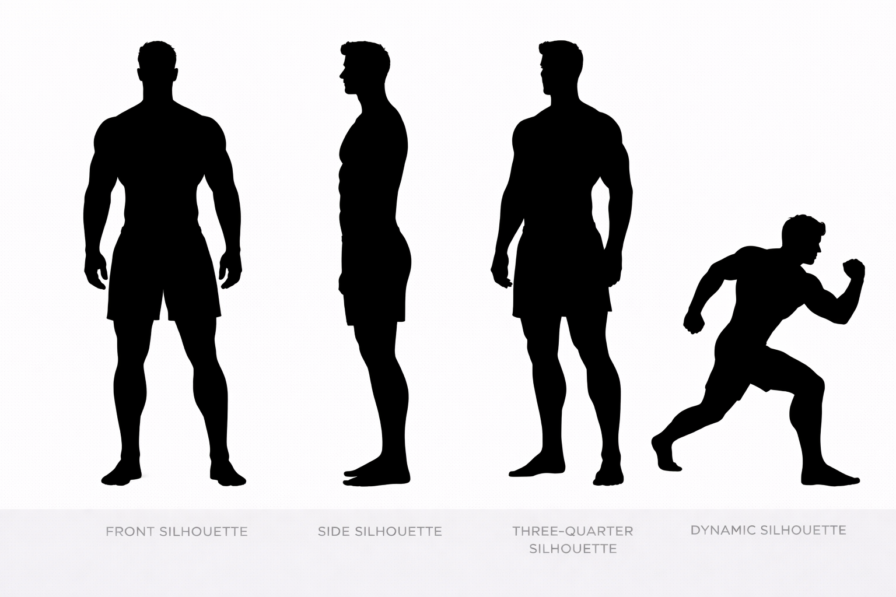

---
hide:
  - toc
---

# Blake vs Danny

## Height Comparison

- **Blake:** 191 cm / 6'3"
- **Danny:** 193 cm / 6'4
- **Difference:** 2 cm / 0'1"
- **Category:** subtle
- **Relative scale:** Danny is approximately 1.0% taller than Blake

  

    
Height Contrast

    
Subtle

  

  

    
Build Contrast

    
Athletic Muscular vs Heavy Muscular

  

  

    
Silhouette Contrast

    
Power Athlete vs Power Frame

  

## Visual Height Chart

  

    
190 cm

    
180 cm

    
170 cm

    
160 cm

    
150 cm

    
140 cm

    
130 cm

    
120 cm

    
110 cm

    
100 cm

    
90 cm

    
80 cm

    
70 cm

    
60 cm

    
50 cm

    
40 cm

    
30 cm

    
20 cm

    
10 cm

  

  

  

    

      
    

    
Reference

    
180 cm / 5'11"

  

  

    

      
    

    
Blake

    
191 cm / 6'3"

  

  

    

      
    

    
Danny

    
193 cm / 6'4

  

## Comparison Summary

**Blake** and **Danny** show a **Subtle height contrast**, with **Danny** standing **2 cm** taller than **Blake**.

In terms of build, **Blake** reads as **Athletic Muscular**, while **Danny** reads as **Heavy Muscular**.

Their silhouettes reinforce this contrast: **Blake** has a **Power Athlete silhouette with **Upper Body emphasis**, characterized by tall, broad, muscular, and imposing, while **Danny** presents a **Power Frame silhouette with **Upper Body emphasis**, characterized by imposing, broad, and heavy set.

Their design language also differs strongly: **Blake** is rooted in a **Athletic Luxury** aesthetic, while **Danny** is defined more by **Rugged Utilitarian** styling.

Their body language pushes this contrast further: **Blake** appears **Open Confident**, while **Danny** appears **Calm Composed**.

Facially, **Blake** tends toward a **Confident Neutral** expression, while **Danny** reads as more **Soft Neutral**.

Their emotional presentation also differs: **Blake** feels **Controlled**, while **Danny** feels **Open Warm**.

## Body Anchor Comparison

  

    
Blake

    
  

  

    
Danny

    
  

## Anatomy Sheet Comparison

  

    
Blake

    
  

  

    
Danny

    
  

## Silhouette Sheet Comparison

  

    
Blake

    
  

  

    
Danny

    
  

