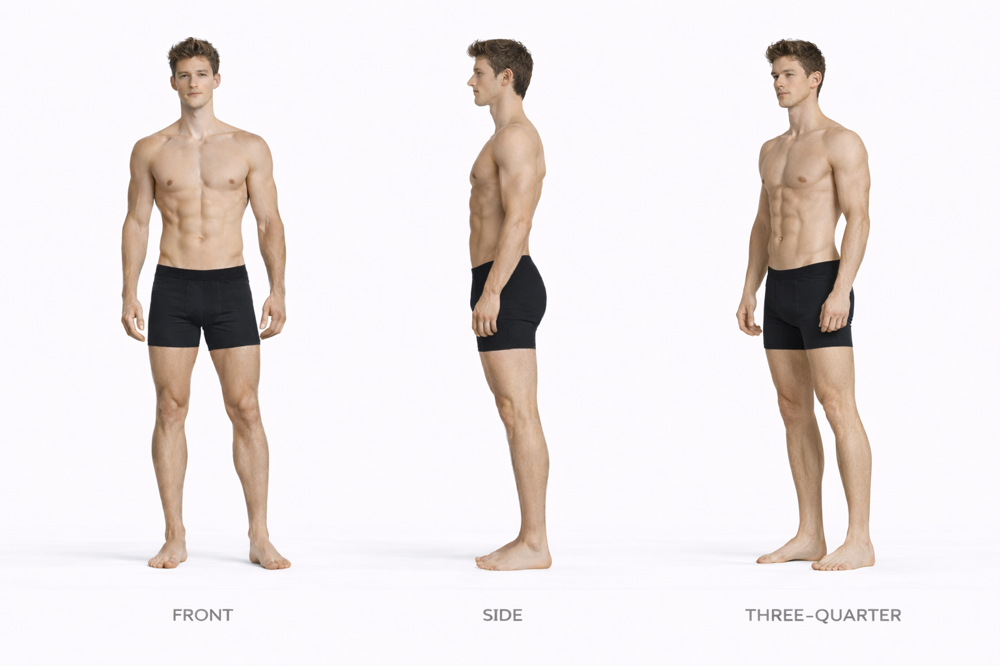
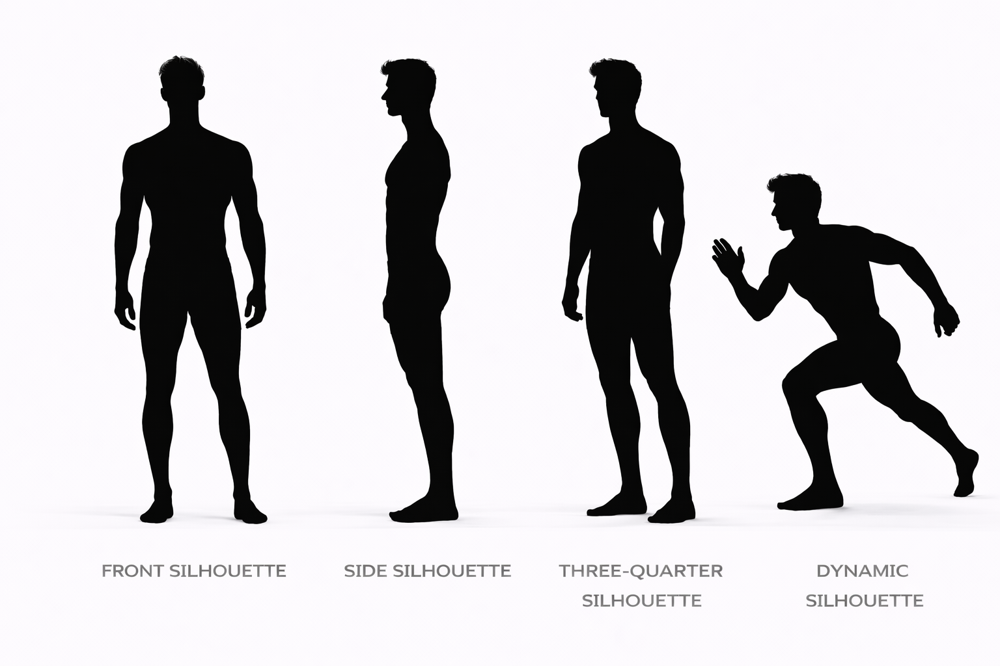

---
hide:
  - toc
---

# Blake vs Hudson

## Height Comparison

- **Blake:** 191 cm / 6'3"
- **Hudson:** 188 cm / 6'2
- **Difference:** 3 cm / 0'1"
- **Category:** subtle
- **Relative scale:** Blake is approximately 1.6% taller than Hudson

  

    
Height Contrast

    
Subtle

  

  

    
Build Contrast

    
Athletic Muscular vs Athletic Muscular

  

  

    
Silhouette Contrast

    
Power Athlete vs Power Athlete

  

## Visual Height Chart

  

    
190 cm

    
180 cm

    
170 cm

    
160 cm

    
150 cm

    
140 cm

    
130 cm

    
120 cm

    
110 cm

    
100 cm

    
90 cm

    
80 cm

    
70 cm

    
60 cm

    
50 cm

    
40 cm

    
30 cm

    
20 cm

    
10 cm

  

  

  

    

      
    

    
Reference

    
180 cm / 5'11"

  

  

    

      
    

    
Blake

    
191 cm / 6'3"

  

  

    

      
    

    
Hudson

    
188 cm / 6'2

  

## Comparison Summary

**Blake** and **Hudson** show a **Subtle height contrast**, with **Blake** standing **3 cm** taller than **Hudson**.

In terms of build, **Blake** reads as **Athletic Muscular**, while **Hudson** reads as **Athletic Muscular**.

Their silhouettes reinforce this contrast: **Blake** has a **Power Athlete silhouette with **Upper Body emphasis**, characterized by tall, broad, muscular, and imposing, while **Hudson** presents a **Power Athlete silhouette with **Shoulders emphasis**, characterized by tall, broad, and agile.

In motion, **Blake** reads as **Grounded Powerful**, whereas **Hudson** feels more **Relaxed Natural**.

## Body Anchor Comparison

  

    
Blake

    
  

  

    
Hudson

    
  

## Anatomy Sheet Comparison

  

    
Blake

    
  

  

    
Hudson

    
  

## Silhouette Sheet Comparison

  

    
Blake

    
  

  

    
Hudson

    
  

