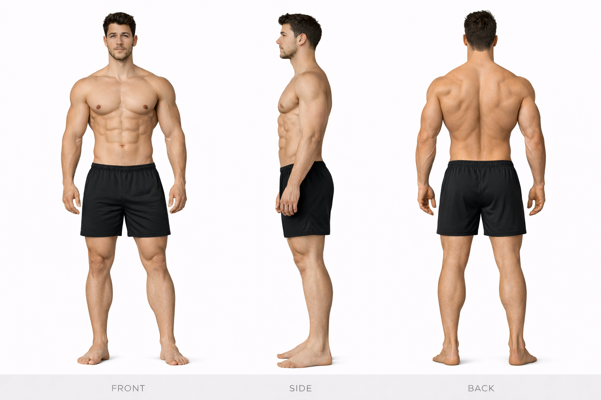
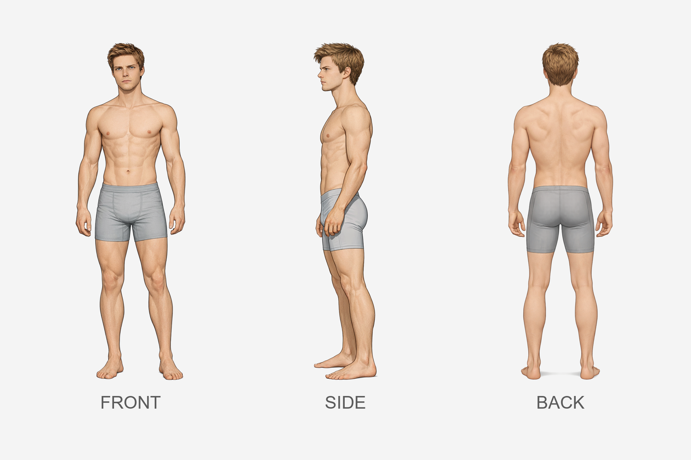

# Blake vs Jasper

## Height Comparison

- **Blake:** 191 cm / 6'3"
- **Jasper:** 170 cm / 5'7"
- **Difference:** 21 cm / 0'8"
- **Category:** dramatic
- **Relative scale:** Blake is approximately 12.4% taller than Jasper

  

    
Height Contrast

    
Dramatic

  

  

    
Build Contrast

    
Athletic Muscular vs Runner Build

  

  

    
Silhouette Contrast

    
Power Athlete vs Runner Silhouette

  

## Visual Height Chart

  

  

    

      

    

    
Blake

    
191 cm / 6'3"

  

  

    

      

    

    
Jasper

    
170 cm / 5'7"

  

## Comparison Summary

**Blake** and **Jasper** show a **Dramatic height contrast**, with **Blake** standing **21 cm** taller than **Jasper**.

In terms of build, **Blake** reads as **Athletic Muscular**, while **Jasper** reads as **Runner Build**.

Their design language also differs strongly: **Blake** is rooted in a **Athletic Luxury** aesthetic, while **Jasper** is defined more by **Exhibitionist** styling.

In motion, **Blake** reads as **Grounded Powerful**, whereas **Jasper** feels more **Restless Quick**.

Facially, **Blake** tends toward a **Confident Neutral** expression, while **Jasper** reads as more **Soft Neutral**.

Their emotional presentation also differs: **Blake** feels **Controlled**, while **Jasper** feels **Open Warm**.

## Anatomy Sheet Comparison

  

    
Blake

    
  

  

    
Jasper

    
  

## Available References

  

    
Blake — Body Anchor

    
  

