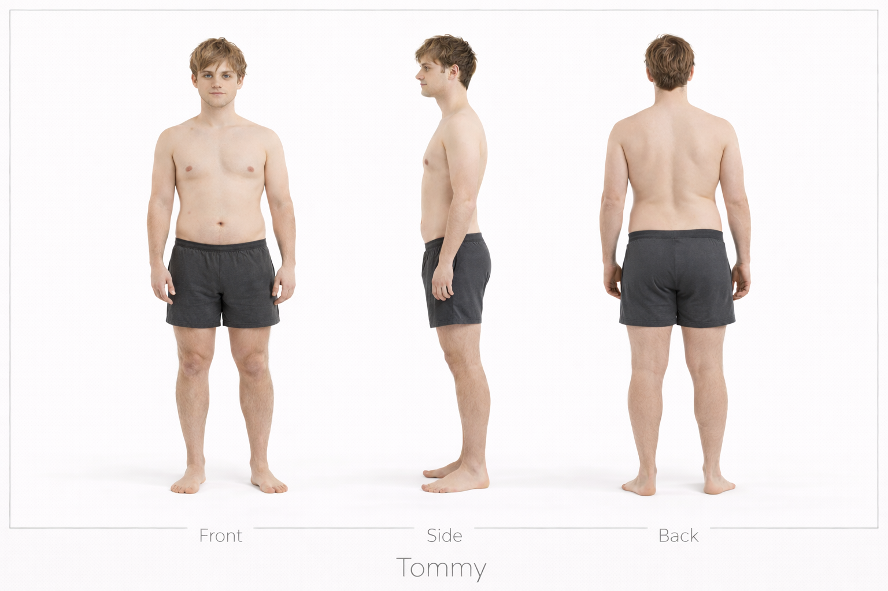

# Daimon vs Tommy

## Height Comparison

- **Daimon:** 196 cm / 6'5"
- **Tommy:** 175 cm / 5'9"
- **Difference:** 21 cm / 0'8"
- **Category:** dramatic
- **Relative scale:** Daimon is approximately 12.0% taller than Tommy

  

    
Height Contrast

    
Dramatic

  

  

    
Build Contrast

    
Heavy Muscular vs Soft Slender

  

  

    
Silhouette Contrast

    
Power Frame vs Hip Dominant Soft

  

## Visual Height Chart

  

    

      

    

    
Daimon

    
196 cm / 6'5"

  

  

    

      

    

    
Tommy

    
175 cm / 5'9"

  

## Comparison Summary

**Daimon** and **Tommy** show a **Dramatic height contrast**, with **Daimon** standing **21 cm** taller than **Tommy**.

In terms of build, **Daimon** reads as **Heavy Muscular**, while **Tommy** reads as **Soft Slender**.

Their design language also differs strongly: **Daimon** is rooted in a **Rugged Utilitarian** aesthetic, while **Tommy** is defined more by **Domestic Soft** styling.

In motion, **Daimon** reads as **Grounded Powerful**, whereas **Tommy** feels more **Relaxed Natural**.

Their body language pushes this contrast further: **Daimon** appears **Calm Composed**, while **Tommy** appears **Soft Withdrawn**.

Facially, **Daimon** tends toward a **Serious Controlled** expression, while **Tommy** reads as more **Soft Neutral**.

Their emotional presentation also differs: **Daimon** feels **Intense**, while **Tommy** feels **Open Warm**.

## Available References

  

    
Tommy — Anatomy Sheet

    
  

