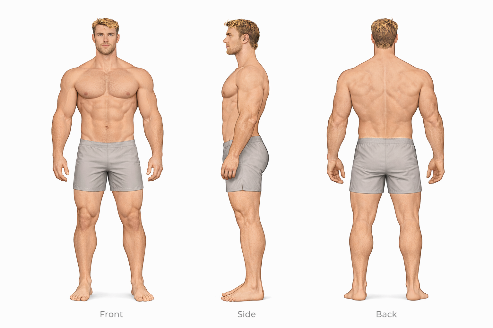

# Danny vs Hudson

## Height Comparison

- **Danny:** 193 cm / 6'4
- **Hudson:** 188 cm / 6'2
- **Difference:** 5 cm / 0'2"
- **Category:** subtle
- **Relative scale:** Danny is approximately 2.7% taller than Hudson

  

    
Height Contrast

    
Subtle

  

  

    
Build Contrast

    
Heavy Muscular vs Athletic Muscular

  

  

    
Silhouette Contrast

    
Power Frame vs Power Athlete

  

## Visual Height Chart

  

    
190 cm

    
180 cm

    
170 cm

    
160 cm

    
150 cm

    
140 cm

    
130 cm

    
120 cm

    
110 cm

    
100 cm

    
90 cm

    
80 cm

    
70 cm

    
60 cm

    
50 cm

    
40 cm

    
30 cm

    
20 cm

    
10 cm

  

  

  

    

      

    

    
Danny

    
193 cm / 6'4

  

  

    

      

    

    
Hudson

    
188 cm / 6'2

  

## Comparison Summary

**Danny** and **Hudson** show a **Subtle height contrast**, with **Danny** standing **5 cm** taller than **Hudson**.

In terms of build, **Danny** reads as **Heavy Muscular**, while **Hudson** reads as **Athletic Muscular**.

Their design language also differs strongly: **Danny** is rooted in a **Rugged Utilitarian** aesthetic, while **Hudson** is defined more by **Athletic Luxury** styling.

In motion, **Danny** reads as **Grounded Powerful**, whereas **Hudson** feels more **Relaxed Natural**.

Their body language pushes this contrast further: **Danny** appears **Calm Composed**, while **Hudson** appears **Open Confident**.

Facially, **Danny** tends toward a **Soft Neutral** expression, while **Hudson** reads as more **Confident Neutral**.

Their emotional presentation also differs: **Danny** feels **Open Warm**, while **Hudson** feels **Controlled**.

## Anatomy Sheet Comparison

  

    
Danny

    
  

  

    
Hudson

    
  

