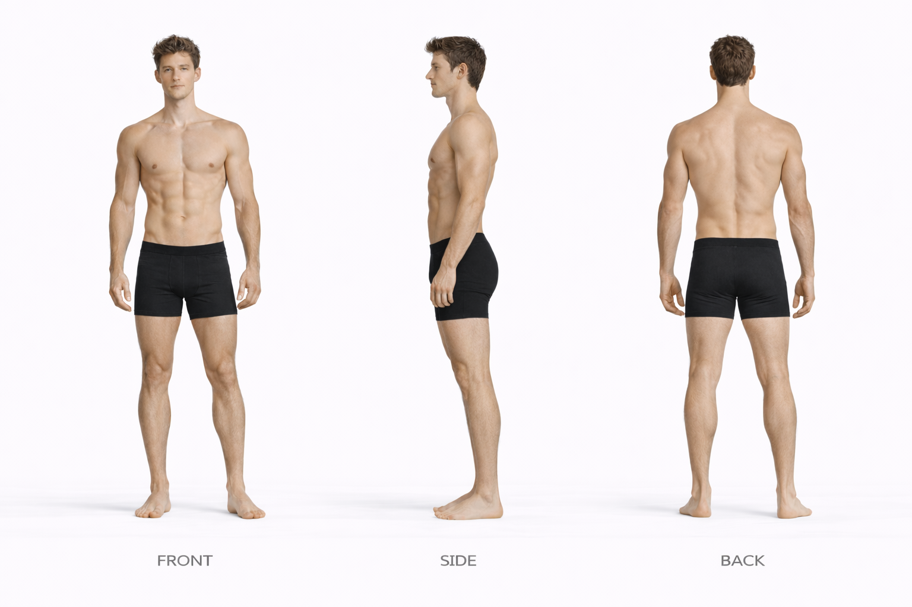
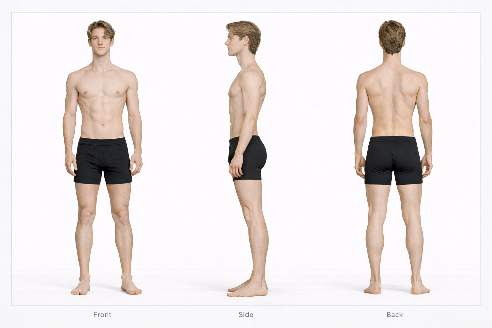
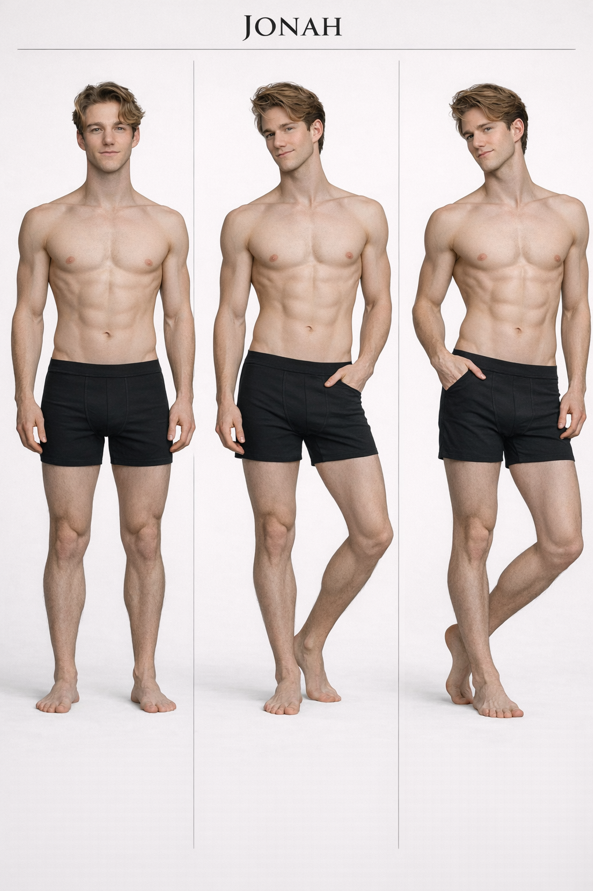

# Hudson vs Jonah

## Height Comparison

- **Hudson:** 188 cm / 6'2
- **Jonah:** 178 cm / 5'10"
- **Difference:** 10 cm / 0'4"
- **Category:** noticeable
- **Relative scale:** Hudson is approximately 5.6% taller than Jonah

  

    
Height Contrast

    
Noticeable

  

  

    
Build Contrast

    
Athletic Muscular vs Elongated Slender

  

  

    
Silhouette Contrast

    
Power Athlete vs Runner Silhouette

  

## Visual Height Chart

  

    

      

    

    
Hudson

    
188 cm / 6'2

  

  

    

      

    

    
Jonah

    
178 cm / 5'10"

  

## Comparison Summary

**Hudson** and **Jonah** show a **Noticeable height contrast**, with **Hudson** standing **10 cm** taller than **Jonah**.

In terms of build, **Hudson** reads as **Athletic Muscular**, while **Jonah** reads as **Elongated Slender**.

Their design language also differs strongly: **Hudson** is rooted in a **Athletic Luxury** aesthetic, while **Jonah** is defined more by **Playful Athletic** styling.

Facially, **Hudson** tends toward a **Confident Neutral** expression, while **Jonah** reads as more **Soft Neutral**.

Their emotional presentation also differs: **Hudson** feels **Controlled**, while **Jonah** feels **Open Warm**.

## Anatomy Sheet Comparison

  

    
Hudson

    
  

  

    
Jonah

    
  

## Available References

  

    
Jonah — Body Anchor

    
  

