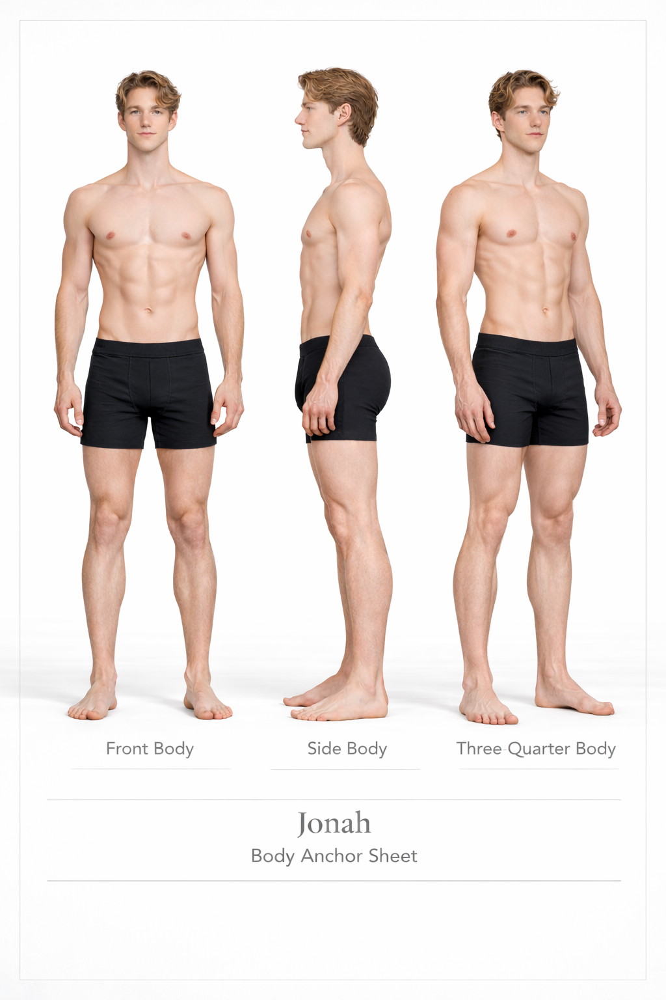
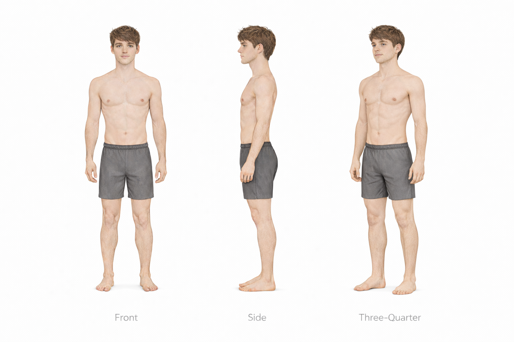
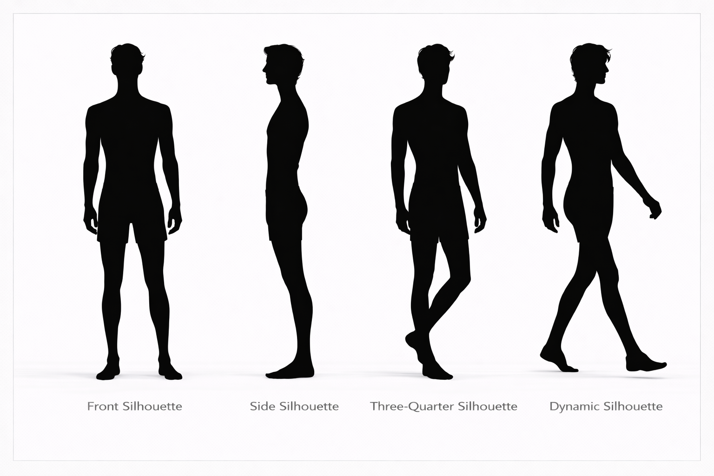
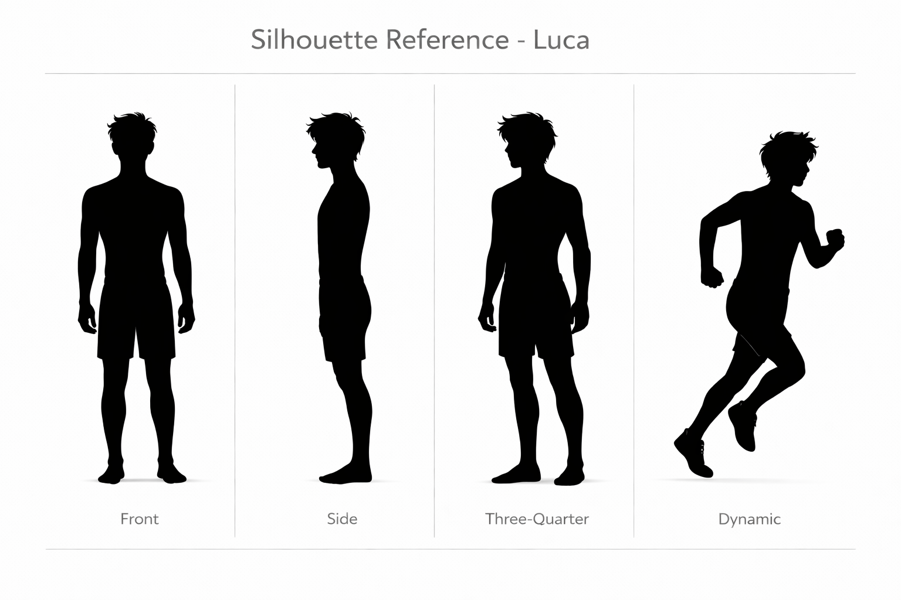

---
hide:
  - toc
---

# Jonah vs Luca

## Height Comparison

- **Jonah:** 178 cm / 5'10"
- **Luca:** 168 cm / 5'6
- **Difference:** 10 cm / 0'4"
- **Category:** noticeable
- **Relative scale:** Jonah is approximately 6.0% taller than Luca

  

    
Height Contrast

    
Noticeable

  

  

    
Build Contrast

    
Lower Athletic vs Light Athletic

  

  

    
Silhouette Contrast

    
Runner Silhouette vs Compact Frame

  

## Visual Height Chart

  

    
180 cm

    
170 cm

    
160 cm

    
150 cm

    
140 cm

    
130 cm

    
120 cm

    
110 cm

    
100 cm

    
90 cm

    
80 cm

    
70 cm

    
60 cm

    
50 cm

    
40 cm

    
30 cm

    
20 cm

    
10 cm

  

  

  

    

      
    

    
Reference

    
180 cm / 5'11"

  

  

    

      
    

    
Jonah

    
178 cm / 5'10"

  

  

    

      
    

    
Luca

    
168 cm / 5'6

  

## Comparison Summary

**Jonah** and **Luca** show a **Noticeable height contrast**, with **Jonah** standing **10 cm** taller than **Luca**.

In terms of build, **Jonah** reads as **Lower Athletic**, while **Luca** reads as **Light Athletic**.

Their silhouettes reinforce this contrast: **Jonah** has a **Runner Silhouette silhouette with **Legs emphasis**, characterized by long-limbed, elegant, and athletic, while **Luca** presents a **Compact Frame silhouette with **Balanced emphasis**, characterized by compact, agile, and light frame.

Their design language also differs strongly: **Jonah** is rooted in a **Playful Athletic** aesthetic, while **Luca** is defined more by **Domestic Soft** styling.

Their body language pushes this contrast further: **Jonah** appears **Open Confident**, while **Luca** appears **Soft Withdrawn**.

## Body Anchor Comparison

  

    
Jonah

    
  

  

    
Luca

    
  

## Anatomy Sheet Comparison

  

    
Jonah

    
  

  

    
Luca

    
  

## Silhouette Sheet Comparison

  

    
Jonah

    
  

  

    
Luca

    
  

