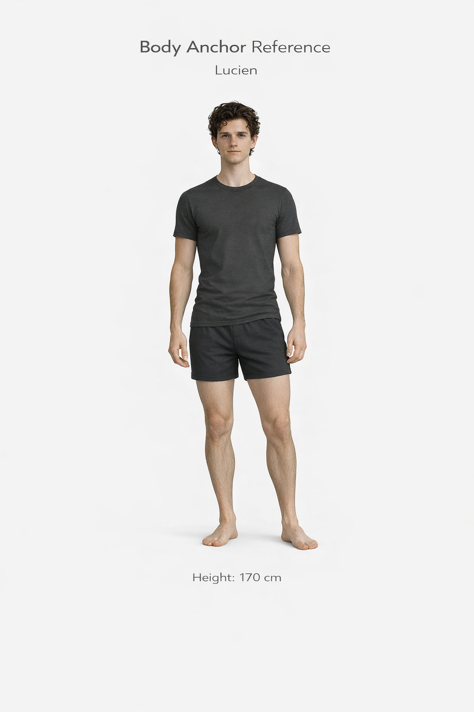
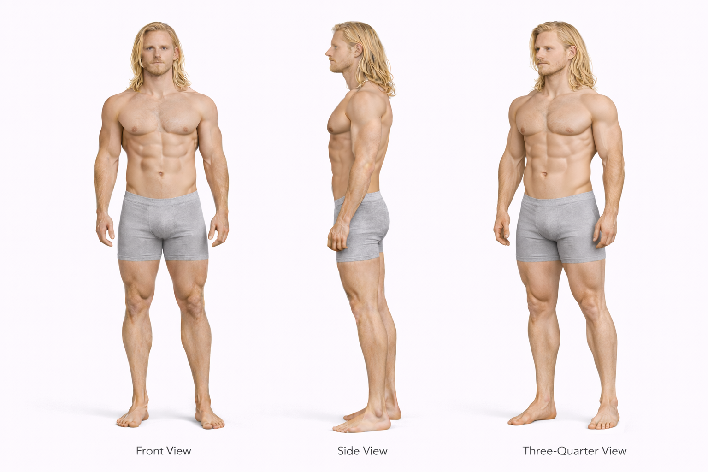
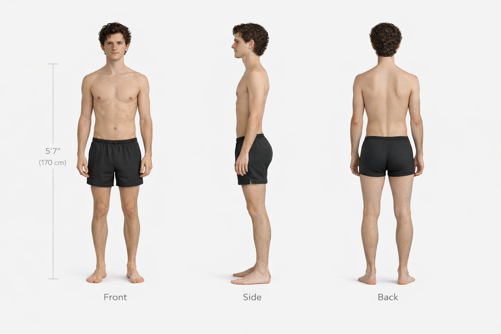
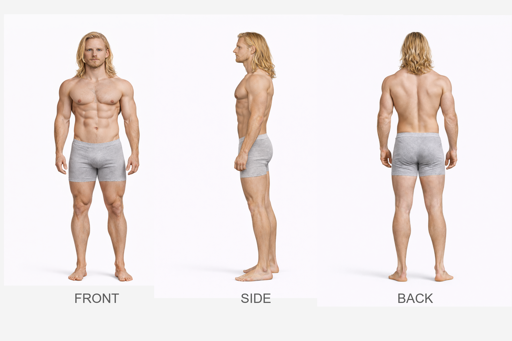
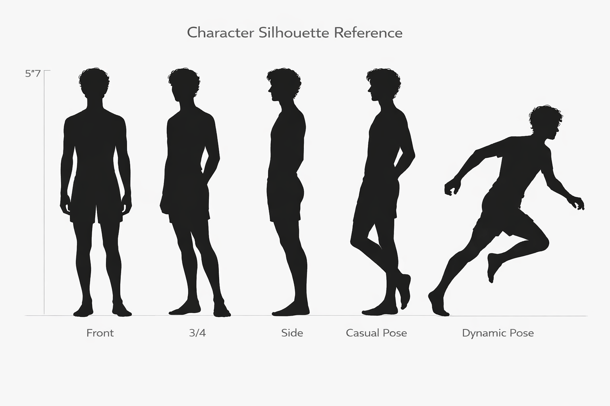

---
hide:
  - toc
---

# Lucien vs Ragnar

## Height Comparison

- **Lucien:** 170 cm / 5'7"
- **Ragnar:** 208 cm / 6'10"
- **Difference:** 38 cm / 1'3"
- **Category:** extreme
- **Relative scale:** Ragnar is approximately 22.4% taller than Lucien

  

    
Height Contrast

    
Extreme

  

  

    
Build Contrast

    
Narrow Slender vs Heavy Muscular

  

  

    
Silhouette Contrast

    
Glute Slender vs Power Frame

  

## Visual Height Chart

  

    
200 cm

    
190 cm

    
180 cm

    
170 cm

    
160 cm

    
150 cm

    
140 cm

    
130 cm

    
120 cm

    
110 cm

    
100 cm

    
90 cm

    
80 cm

    
70 cm

    
60 cm

    
50 cm

    
40 cm

    
30 cm

    
20 cm

    
10 cm

  

  

  

    

      
    

    
Reference

    
180 cm / 5'11"

  

  

    

      
    

    
Lucien

    
170 cm / 5'7"

  

  

    

      
    

    
Ragnar

    
208 cm / 6'10"

  

## Comparison Summary

**Lucien** and **Ragnar** show a **Extreme height contrast**, with **Ragnar** standing **38 cm** taller than **Lucien**.

In terms of build, **Lucien** reads as **Narrow Slender**, while **Ragnar** reads as **Heavy Muscular**.

Their silhouettes reinforce this contrast: **Lucien** has a **Glute Slender silhouette with **Glutes emphasis**, characterized by slender, leg dominant, and glute emphasis, while **Ragnar** presents a **Power Frame silhouette with **Upper Body emphasis**, characterized by tall, broad, imposing, massive, and upper dominant.

Their design language also differs strongly: **Lucien** is rooted in a **Occult** aesthetic, while **Ragnar** is defined more by **Rugged Utilitarian** styling.

In motion, **Lucien** reads as **Deliberate Precise**, whereas **Ragnar** feels more **Grounded Powerful**.

Facially, **Lucien** tends toward a **Calm Reserved** expression, while **Ragnar** reads as more **Serious Controlled**.

## Body Anchor Comparison

  

    
Lucien

    
  

  

    
Ragnar

    
  

## Anatomy Sheet Comparison

  

    
Lucien

    
  

  

    
Ragnar

    
  

## Silhouette Sheet Comparison

  

    
Lucien

    
  

  

    
Ragnar

    
  

