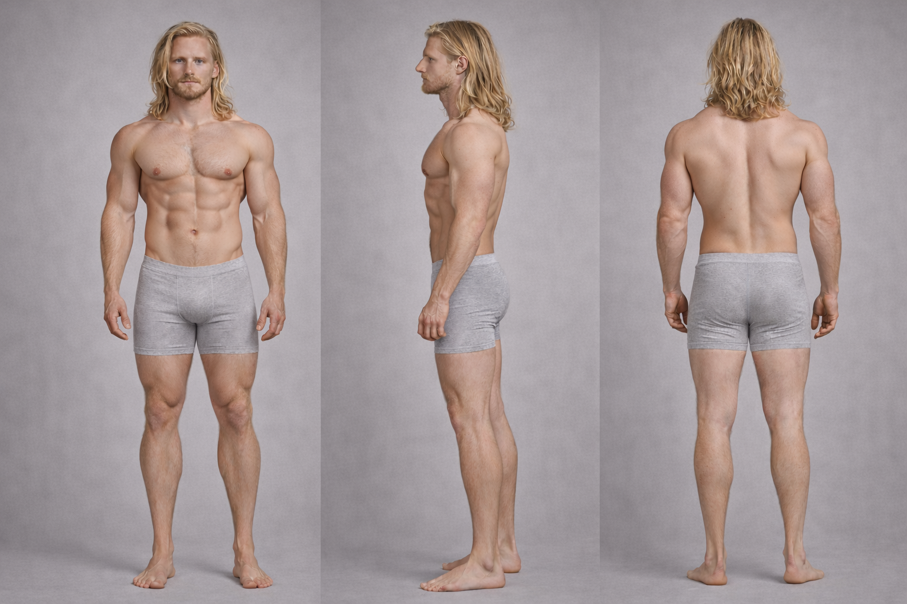

# Lucien vs Ragnar

## Height Comparison

- **Lucien:** 170 cm / 5'7"
- **Ragnar:** 208 cm / 6'10"
- **Difference:** 38 cm / 1'3"
- **Category:** extreme
- **Relative scale:** Ragnar is approximately 22.4% taller than Lucien

  

    
Height Contrast

    
Extreme

  

  

    
Build Contrast

    
Narrow Slender vs Heavy Muscular

  

  

    
Silhouette Contrast

    
Glute Slender vs Power Frame

  

## Visual Height Chart

  

    

      

    

    
Lucien

    
170 cm / 5'7"

  

  

    

      

    

    
Ragnar

    
208 cm / 6'10"

  

## Comparison Summary

**Lucien** and **Ragnar** show a **Extreme height contrast**, with **Ragnar** standing **38 cm** taller than **Lucien**.

In terms of build, **Lucien** reads as **Narrow Slender**, while **Ragnar** reads as **Heavy Muscular**.

Their design language also differs strongly: **Lucien** is rooted in a **Occult** aesthetic, while **Ragnar** is defined more by **Rugged Utilitarian** styling.

In motion, **Lucien** reads as **Deliberate Precise**, whereas **Ragnar** feels more **Grounded Powerful**.

Facially, **Lucien** tends toward a **Calm Reserved** expression, while **Ragnar** reads as more **Serious Controlled**.

## Body Anchor Comparison

  

    
Lucien

    
  

  

    
Ragnar

    
  

## Anatomy Sheet Comparison

  

    
Lucien

    
  

  

    
Ragnar

    
  

## Available References

  

    
Lucien — Silhouette Sheet

    
  

