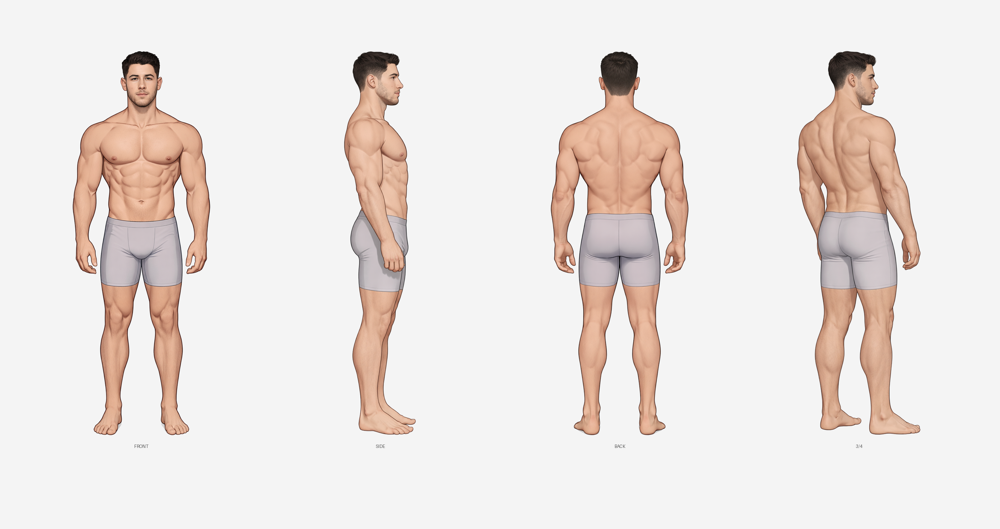

  

    <h3><a href="../../characters/blake/">Blake</a></h3>
    
  

  

    <h3><a href="../../characters/danny/">Danny</a></h3>
    
  

  

    <h3><a href="../../characters/hudson/">Hudson</a></h3>
    
  

  

    <h3><a href="../../characters/lucien/">Lucien</a></h3>
    
  

  

    <h3><a href="../../characters/ragnar/">Ragnar</a></h3>
    
  

