

  

    <h3><a href="../../characters/blake/">Blake</a></h3>
    <a href="../../assets/library/10_CHARACTERS/BLAKE/01_IDENTITY/face/blake_face_anchor_v3.png" target="_blank">
      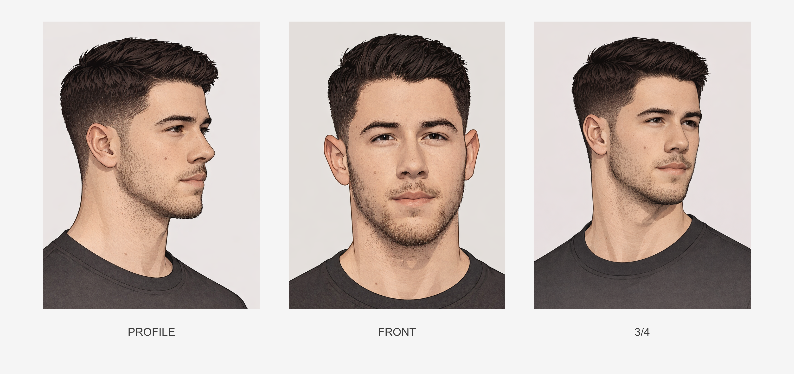
    </a>
  

  

    <h3><a href="../../characters/daimon/">Daimon</a></h3>
    <a href="../../assets/library/10_CHARACTERS/DAIMON/01_IDENTITY/face/daimon_face_anchor_v1.png" target="_blank">
      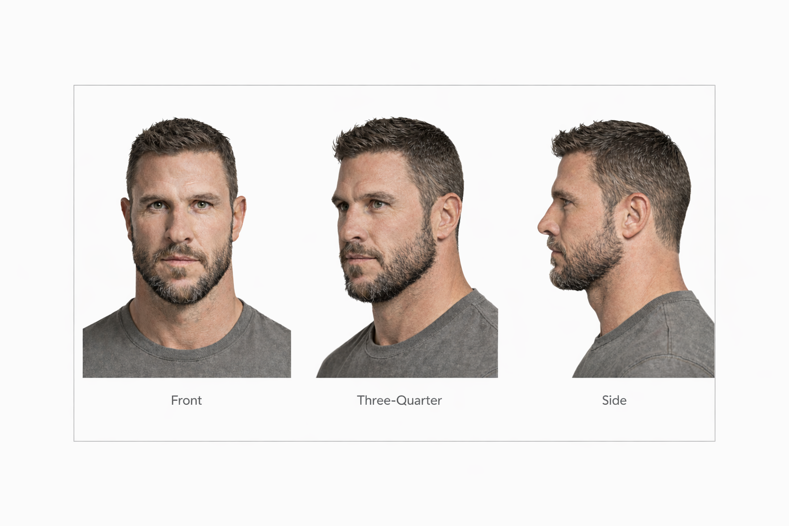
    </a>
  

  

    <h3><a href="../../characters/danny/">Danny</a></h3>
    <a href="../../assets/library/10_CHARACTERS/DANNY/01_IDENTITY/face/danny_face_anchor_v2.png" target="_blank">
      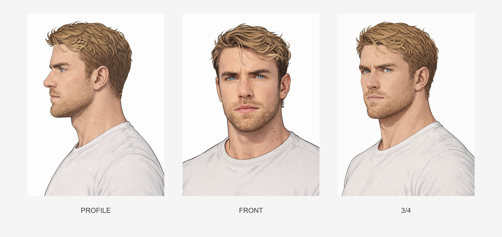
    </a>
  

  

    <h3><a href="../../characters/hudson/">Hudson</a></h3>
    <a href="../../assets/library/10_CHARACTERS/HUDSON/01_IDENTITY/face/hudson_face_anchor_v1.png" target="_blank">
      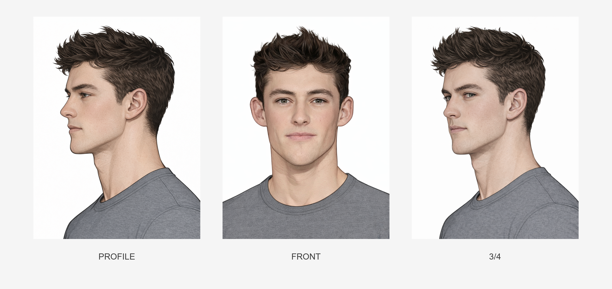
    </a>
  

  

    <h3><a href="../../characters/jasper/">Jasper</a></h3>
    <a href="../../assets/library/10_CHARACTERS/JASPER/01_IDENTITY/face/jasper_face_anchor_v6.png" target="_blank">
      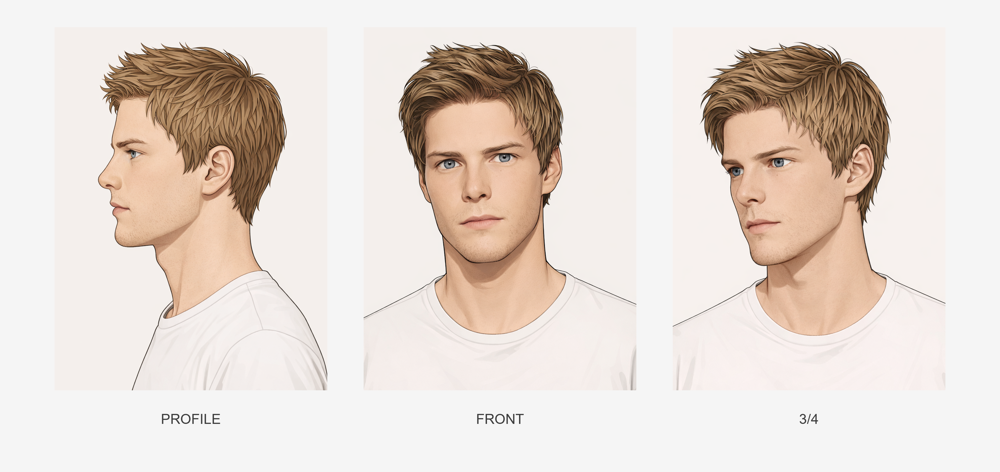
    </a>
  

  

    <h3><a href="../../characters/jonah/">Jonah</a></h3>
    <a href="../../assets/library/10_CHARACTERS/JONAH/01_IDENTITY/face/jonah_face_anchor_v3.png" target="_blank">
      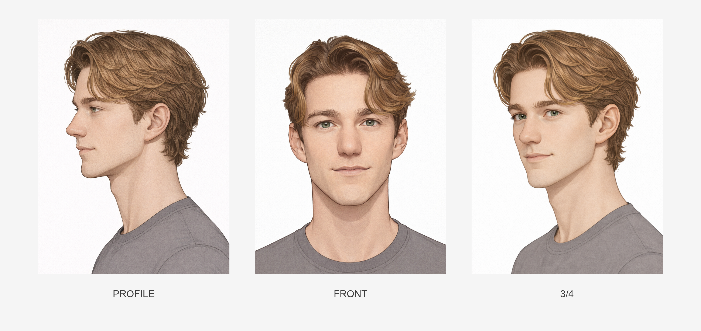
    </a>
  

  

    <h3><a href="../../characters/luca/">Luca</a></h3>
    <a href="../../assets/library/10_CHARACTERS/LUCA/01_IDENTITY/face/luca_face_anchor_v2.png" target="_blank">
      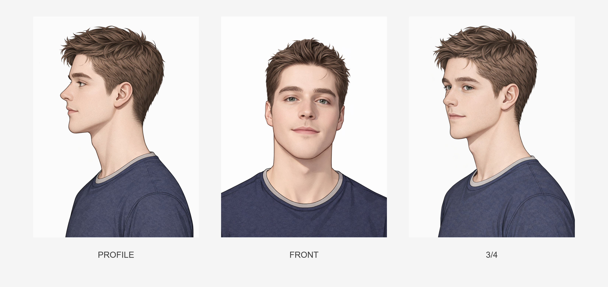
    </a>
  

  

    <h3><a href="../../characters/lucien/">Lucien</a></h3>
    <a href="../../assets/library/10_CHARACTERS/LUCIEN/01_IDENTITY/face/lucien_face_anchor_v2.png" target="_blank">
      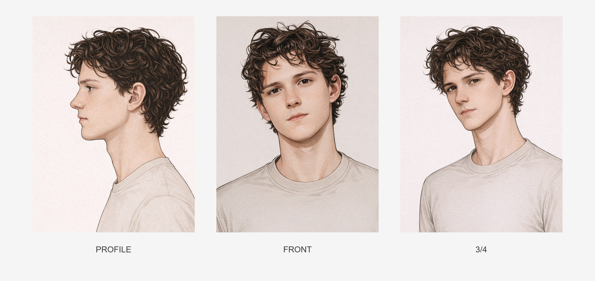
    </a>
  

  

    <h3><a href="../../characters/ragnar/">Ragnar</a></h3>
    <a href="../../assets/library/10_CHARACTERS/RAGNAR/01_IDENTITY/face/ragnar_face_anchor_v2.png" target="_blank">
      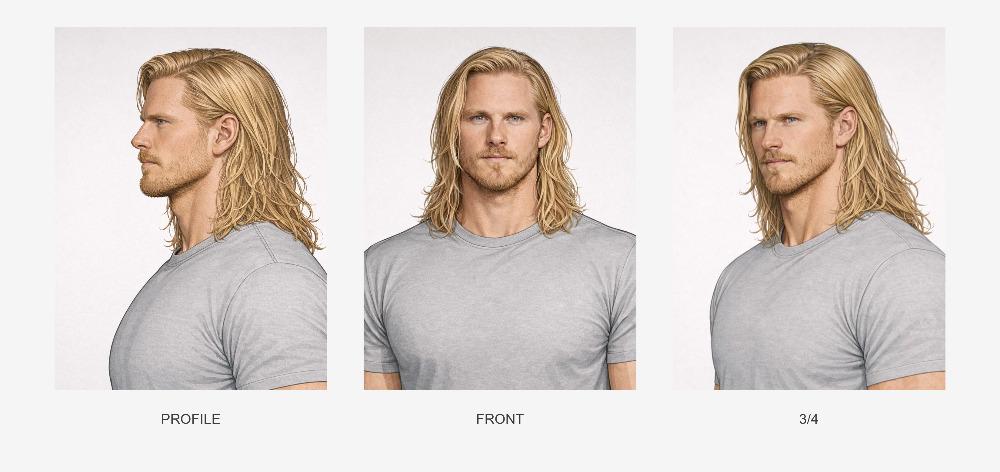
    </a>
  

  

    <h3><a href="../../characters/tommy/">Tommy</a></h3>
    <a href="../../assets/library/10_CHARACTERS/TOMMY/01_IDENTITY/face/tommy_face_anchor_v1.png" target="_blank">
      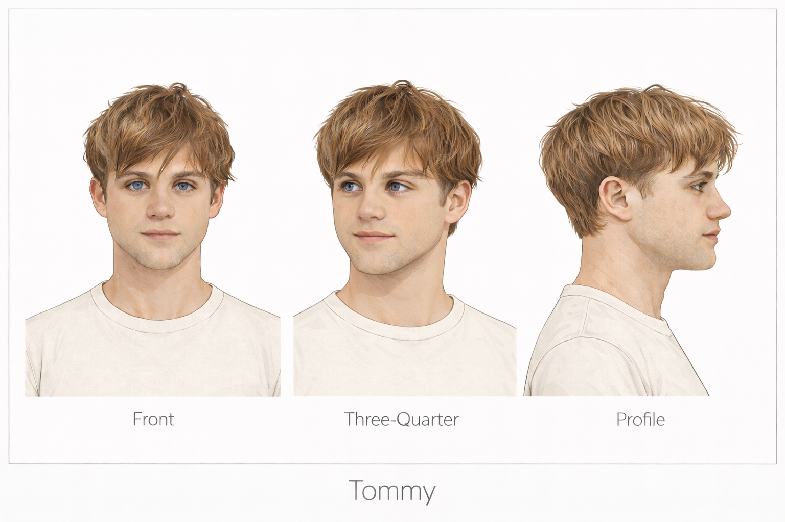
    </a>
  

  

    <h3><a href="../../characters/aaron/">Aaron</a></h3>
    <a href="../../assets/library/10_CHARACTERS/AARON/01_IDENTITY/face/aaron_face_anchor_v1.png" target="_blank">
      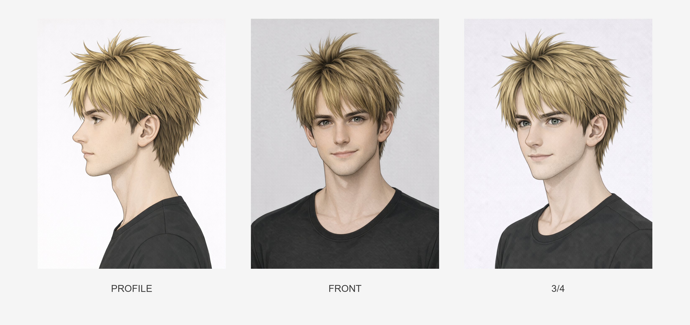
    </a>
  

  

    <h3><a href="../../characters/alek/">Alek</a></h3>
    <a href="../../assets/library/10_CHARACTERS/ALEK/01_IDENTITY/face/alek_face_anchor_v2.png" target="_blank">
      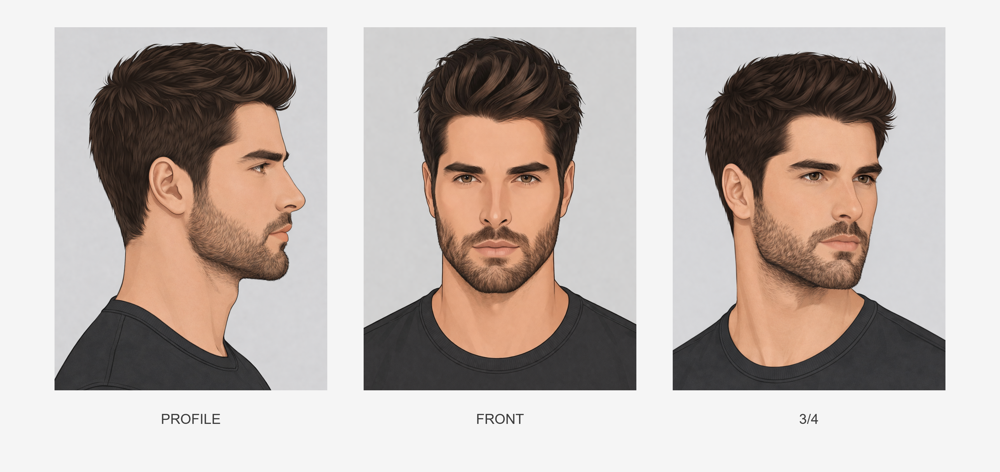
    </a>
  

  

    <h3><a href="../../characters/alexander/">Alexander</a></h3>
    <a href="../../assets/library/10_CHARACTERS/ALEXANDER/01_IDENTITY/face/alexander_face_anchor_v2.png" target="_blank">
      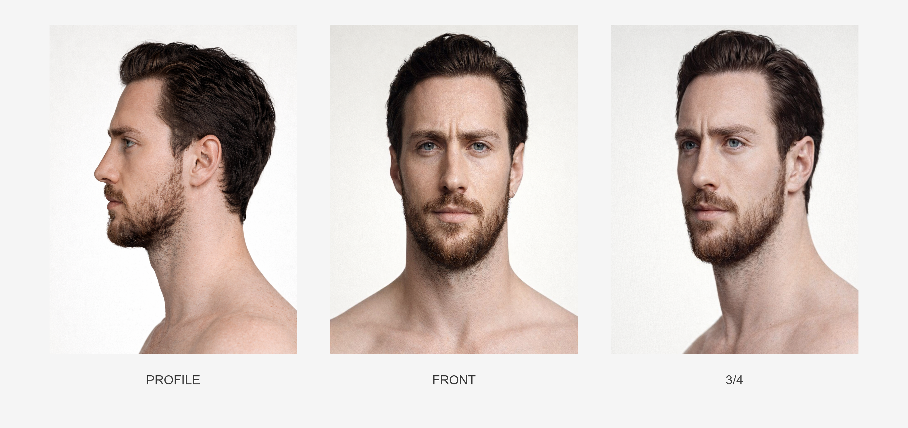
    </a>
  

  

    <h3><a href="../../characters/connor/">Connor</a></h3>
    <a href="../../assets/library/10_CHARACTERS/CONNOR/01_IDENTITY/face/connor_face_anchor_v2.png" target="_blank">
      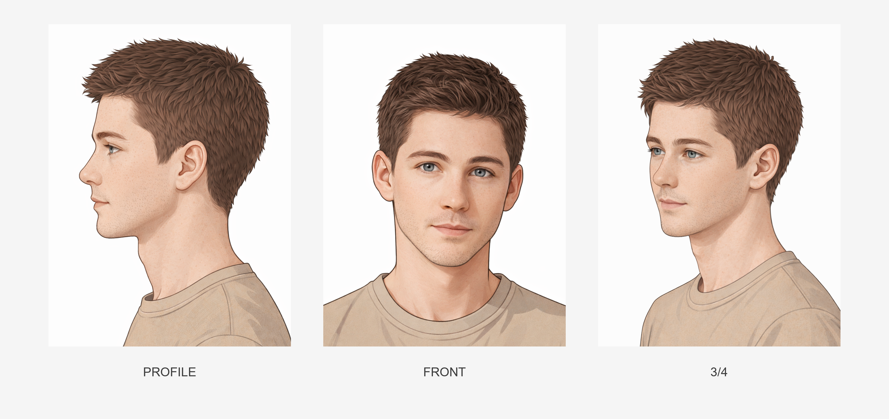
    </a>
  

  

    <h3><a href="../../characters/hunter/">Hunter</a></h3>
    <a href="../../assets/library/10_CHARACTERS/HUNTER/01_IDENTITY/face/hunter_face_anchor_v1.png" target="_blank">
      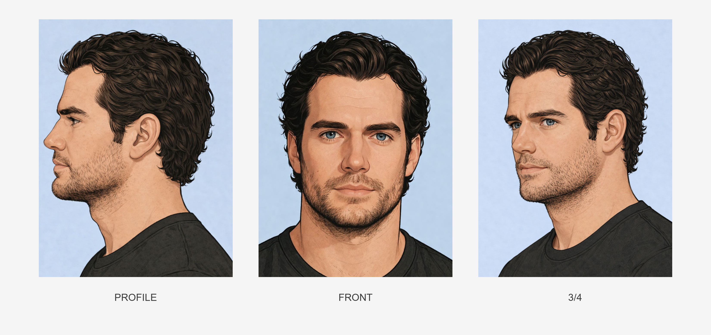
    </a>
  

  

    <h3><a href="../../characters/milo/">Milo</a></h3>
    <a href="../../assets/library/10_CHARACTERS/MILO/01_IDENTITY/face/milo_face_anchor_v1.png" target="_blank">
      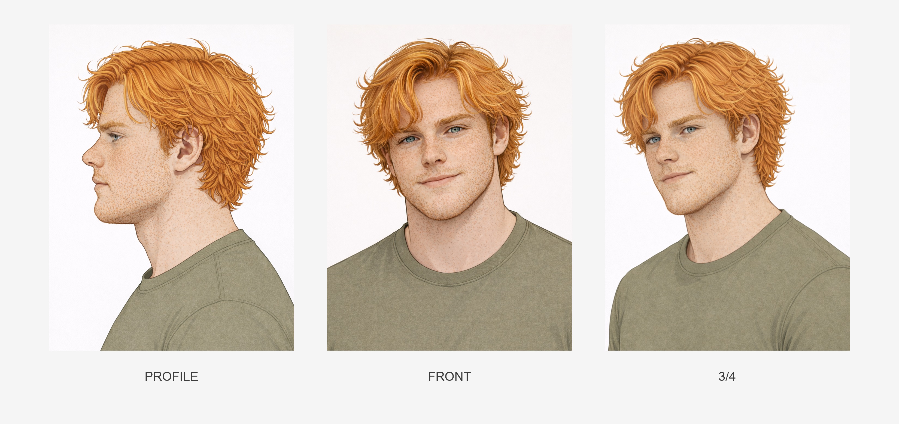
    </a>
  

  

    <h3><a href="../../characters/noel/">Noel</a></h3>
    <a href="../../assets/library/10_CHARACTERS/NOEL/01_IDENTITY/face/noel_face_anchor_v1.png" target="_blank">
      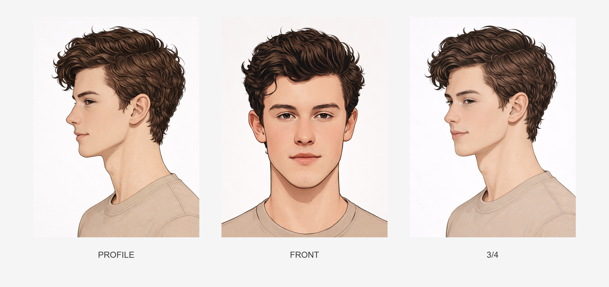
    </a>
  

