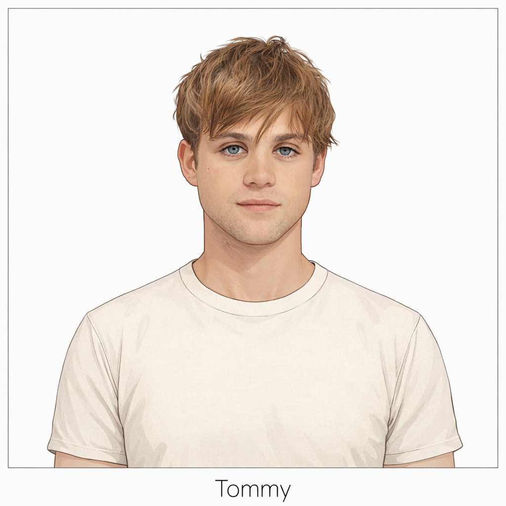

  

    <h3><a href="../../characters/blake/">Blake</a></h3>
    
  

  

    <h3><a href="../../characters/daimon/">Daimon</a></h3>
    
  

  

    <h3><a href="../../characters/danny/">Danny</a></h3>
    
  

  

    <h3><a href="../../characters/hudson/">Hudson</a></h3>
    
  

  

    <h3><a href="../../characters/jasper/">Jasper</a></h3>
    
  

  

    <h3><a href="../../characters/jonah/">Jonah</a></h3>
    
  

  

    <h3><a href="../../characters/luca/">Luca</a></h3>
    
  

  

    <h3><a href="../../characters/lucien/">Lucien</a></h3>
    
  

  

    <h3><a href="../../characters/ragnar/">Ragnar</a></h3>
    
  

  

    <h3><a href="../../characters/tommy/">Tommy</a></h3>
    
  

  

    <h3><a href="../../characters/aaron/">Aaron</a></h3>
    
  

  

    <h3><a href="../../characters/alek/">Alek</a></h3>
    
  

  

    <h3><a href="../../characters/alexander/">Alexander</a></h3>
    
  

  

    <h3><a href="../../characters/connor/">Connor</a></h3>
    
  

  

    <h3><a href="../../characters/hunter/">Hunter</a></h3>
    
  

  

    <h3><a href="../../characters/milo/">Milo</a></h3>
    
  

  

    <h3><a href="../../characters/noel/">Noel</a></h3>
    
  

